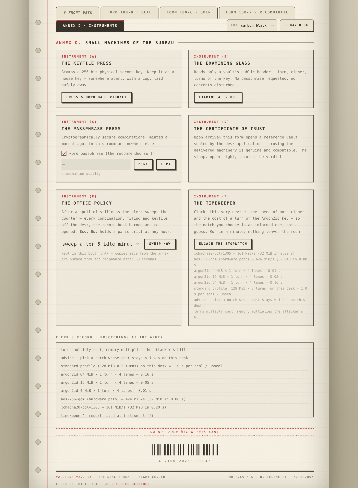
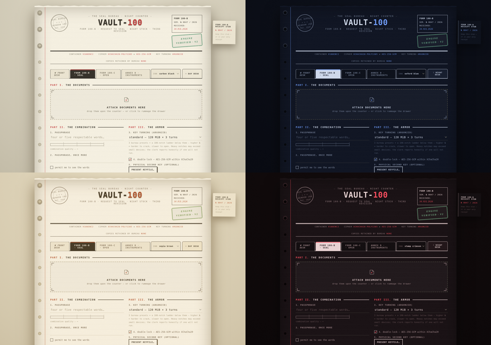

# 🔐 Vault100 — Maximum-Security, Zero-Knowledge File Encryption

**Seal any file into a `.v100` vault — in your browser, from the CLI, or on the desktop. Files, passwords and keys never leave your device.**

[](https://github.com/blazenxt/vault100/releases)
[](LICENSE)
[](#installation)
[](https://vault100.blazenxt.in/)
[](#testing)

🌐 **Live zero-knowledge web app:** **[vault100.blazenxt.in](https://vault100.blazenxt.in/)** — installs as an offline PWA · also [self-hostable](#self-hosting) with one zero-dependency Node server

| 🖥 Desktop GUI | 💻 CLI engine | 🌐 Web counter (PWA) |
|---|---|---|
| Tkinter app — drag files, pick strength, seal | `python -m vault100 encrypt …` | 5 windows, 108 KDF notches, benchmark instruments |

Three bodies, one cloth — **vaults are fully interchangeable** between web, CLI and GUI.

- [Why Vault100](#why-vault100)
- [Security architecture](#-security-architecture)
- [The web counter](#-the-web-counter)
- [Installation](#-install) · [Command line](#-command-line) · [Self-hosting](#-self-hosting-zero-knowledge)
- [Testing](#-testing) · [Honest limitations](#-honest-limitations)
- [Contributing](CONTRIBUTING.md) · [Security policy](SECURITY.md)

## Why Vault100

* **Zero-knowledge by design** — all cryptography runs locally (Web Worker / native). No accounts, no telemetry, no escrow, no uploads — verifiable in the source and by DevTools.
* **Layered, honest security** — XChaCha20-Poly1305 secretstream, optional AES-256-GCM cascade, Argon2id memory-hard KDF with **108 tunable notches** plus per-device benchmarks ("the timekeeper").
* **Real-world conveniences** — instant passphrase change without re-encrypting the body, 256-bit keyfiles, gzip inside the vault, whole-folder sealing, filename restore, offline PWA.
* **Open and documented** — MIT license, fully specified container format, 55 automated tests, CLI↔web byte-exact compatibility proofs.

<a id="-the-web-counter"></a>
## 🌐 The web counter

**Live at [vault100.blazenxt.in](https://vault100.blazenxt.in/)** — five windows at the Seal Bureau, zero knowledge end to end, and installable as an offline-first PWA:

| Window | What it does |
|---|---|
| Form 100-B · Seal | files & whole folders → `.v100` · 108 KDF notches · cascade · keyfile · gzip |
| Form 100-C · Open | local decrypt · original names restored · peeking facts · examining tray preview |
| Form 100-R · Recombinate | instant passphrase/keyfile change — head re-sealed, body untouched |
| Annex D · Instruments | keyfile press · passphrase mint · examining glass · **timekeeper** device benchmarks · office sweep policy |
| Esc, Esc anywhere | panic drill — wipes the counter and burns the record book |




Everything the counter does, the CLI and desktop app do as well — and **vaults open byte-exactly across all three**.

## Why Vault100

* **Zero-knowledge by design** — all cryptography runs locally (Web Worker / native). No accounts, no telemetry, no escrow, no uploads — verifiable in the source and by DevTools.
* **Layered, honest security** — XChaCha20-Poly1305 secretstream, optional AES-256-GCM cascade, Argon2id memory-hard KDF with **108 tunable notches** plus per-device benchmarks ("the timekeeper").
* **Real-world conveniences** — instant passphrase change without re-encrypting the body, 256-bit keyfiles, gzip inside the vault, whole-folder sealing, filename restore, offline PWA.
* **Open and documented** — MIT license, fully specified container format, 55 automated tests, CLI↔web byte-exact compatibility proofs.

> **Straight talk:** no honest software can promise "impossible to decrypt."
> Vault100 instead layers *independent* defenses — dual ciphers, memory-hard
> key derivation, an optional physical second factor — so that a failure
> anywhere else still leaves your data sealed. Your password (+ keyfile)
> is the one variable you control; the built-in meter helps you choose well.

---

## 🛡️ Security architecture

```
              password ──► Argon2id ──┐
                                       ├─► HKDF-SHA256 ──► KEK ─┐
              keyfile ──► BLAKE2b ────┘  (optional 2nd factor)  │
                                                                ▼
   random FEK ──────────────────────────────────── XChaCha20-Poly1305 wrap
        │
        ▼
   ┌─────────────────┐   optional   ┌────────────────┐
   │ AES-256-GCM ────┼─────────────►│ XChaCha20-     │──► .v100 vault
   │ (cascade layer) │  per chunk   │ Poly1305       │
   └─────────────────┘              │ secretstream   │
                                    └────────────────┘
```

| Layer | Choice | What it buys you |
|---|---|---|
| **Envelope keys** | Random per-file key (FEK) wrapped by your KEK | Instant password changes; no bulk re-encryption ever |
| **Second factor** | `--keyfile` — 256-bit random file (any file works, VeraCrypt-style) | Attackers need *both* factors; password-guessing alone is dead |
| **Outer cipher** | XChaCha20-Poly1305 (libsodium secretstream) | AEAD, 192-bit nonces, auto re-key, truncation-proof |
| **Cascade layer** | `--cascade`: AES-256-GCM sealed *inside* XChaCha20 | If either algorithm is ever broken, the other still holds |
| **KDF** | Argon2id · 128 MiB×3 (`standard`) · 512 MiB×4 (`paranoid`) · **auto-tuned to your machine** (`max`) | GPUs/ASICs get thousands of guesses/sec, not billions |
| **Salt** | Random 32 bytes per vault | Identical files + same password ⇒ totally different vaults |
| **Integrity** | AEAD tag per 1 MiB chunk; immutable stream context as AAD; Poly1305-checked key wrap | Bit-flips, reordering, truncation, header edits — all rejected loudly |
| **Privacy** | Original filename + metadata encrypted inside the vault | Attackers can't even see what the file was called |
| **Anti-DoS** | Untrusted header KDF params sanity-capped | A hostile file can't force a 4 GiB allocation |
| **Atomic writes** | Temp file + rename | A crash mid-operation never leaves a corrupt file |

### v2 file format (`.v100`)

```
 0   8   magic "V100ENC2"
 8   1   format version (2)            ← v1 files still decrypt forever
 9   1   KDF id (1 = Argon2id)
10   4   KDF memory (KiB)
14   4   KDF time cost
18   1   KDF parallelism
19   1   flags (bit0 cascade · bit1 keyfile-required)
20  32   salt (KEK derivation)         ← rewritten by `passwd`
52  24   wrap nonce                    ← rewritten by `passwd`
76  48/80 wrapped FEK (+Poly1305 tag)  ← rewritten by `passwd`
    24   secretstream header           ← immutable; anchors all chunk AAD
     ..  chunks: [uint32 len][ciphertext] …  (last chunk tagged FINAL)

chunk 1 (encrypted ×2 in cascade): metadata JSON {name, size, mtime}
chunk 2..N: your data
```

---

<a id="-install"></a>
## 📦 Install

```bash
cd vault100
pip install -r requirements.txt     # PyNaCl + argon2-cffi + cryptography
# GUI needs tkinter (bundled with Python; Debian/Ubuntu: python3-tk)
```

<a id="-command-line"></a>
## 💻 Command line

```bash
# The classic — strength meter included
python -m vault100 encrypt secret.pdf

# Full armor: dual cipher + auto-tuned KDF + shred originals
python -m vault100 encrypt ./vault-folder/ --cascade --security max --shred

# Two-factor: create a keyfile, then lock a vault with it
python -m vault100 keygen /mnt/usb/my.v100key
python -m vault100 encrypt wallet.dat --keyfile /mnt/usb/my.v100key

# Lock / unlock
python -m vault100 decrypt wallet.dat.v100 --keyfile /mnt/usb/my.v100key

# Change password in ~a second (only the 124-byte key wrap is re-sealed)
python -m vault100 passwd wallet.dat.v100

# Non-secret facts about a vault
python -m vault100 info wallet.dat.v100

# Strong password / passphrase generator
python -m vault100 genpass --count 3
python -m vault100 genpass --passphrase --words 8

# The timekeeper — device speed trials (cipher throughput + Argon2id cost)
python -m vault100 bench

# Secure deletion of anything
python -m vault100 shred old_keys.pem --passes 7
```

Environment/automation: `VAULT100_PASSWORD`, `--password-file`, `-q`.

## 🖥️ Desktop GUI

```bash
python -m vault100.gui
```

**Encrypt** tab — folders, keyfile picker, cascade toggle, security level
(incl. machine auto-tune), live strength meter, shred-after ·
**Decrypt** tab — batch unlock, keyfile, original-name restore ·
**Shred** tab — multi-pass destroyer ·
**Tools** tab — keyfile generator, instant password change, vault inspector.

---

<a id="-testing"></a>
## ✅ Tested security properties (55/55 passing)

```bash
VAULT100_FAST_KDF=1 python3 -m pytest tests/test_crypto.py -v
```

* ✔ Round-trips: empty / boundary / multi-chunk / cascade / keyfile
* ✔ Wrong password, wrong keyfile, missing keyfile → rejected
* ✔ Wrapped-FEK tampering → rejected (Poly1305 on the key wrap)
* ✔ Any bit-flip, truncation, trailing garbage, header edit → rejected
* ✔ Hostile DoS headers (4 GiB KDF claim, unknown flags) → rejected cheaply
* ✔ `passwd` re-seals the key instantly; old password dies; data bytes untouched
* ✔ Keyfile can be added later via `passwd` — vault upgrades to two-factor
* ✔ v1 vaults decrypt forever (backward compatibility tested)
* ✔ Same input twice → different ciphertext (random salt + FEK)

## ⚠️ Honest limitations

* **`passwd` caveat:** anyone holding a *copy of the old vault file* plus the
  old password can still decrypt that copy (standard for LUKS/VeraCrypt too).
  Shred old copies if that matters to you.
* **Keyfile = house key:** store it separately, keep a backup — lose it and
  the vault is sealed forever. Same for your password. No backdoors exist.
* Shredding is reliable on HDDs; flash/SSD wear-levelling may keep ghost
  copies — encrypt *before* data hits disk where possible.
* Python can't guarantee keys are scrubbed from RAM (OS-managed); use
  full-disk encryption alongside for nation-state threat models.
* Not yet professionally audited. Keep backups of anything important.

<a id="-self-hosting-zero-knowledge"></a>
## 🌐 Self-hosting (zero-knowledge)

`web/` is a static, **zero-knowledge** web app: all encryption happens in the
visitor's browser (WASM libsodium + Argon2, WebCrypto AES-GCM cascade) and
the server is a dumb file host. Vaults are **byte-compatible with this CLI**
— verified bidirectionally in the test lab. See `web/DEPLOY.md` for
turnkey deployment (Caddy/Nginx, auto-HTTPS, hardened CSP/HSTS headers) and
the operational rules that keep it zero-knowledge.

```bash
docker build -t vault100 . && docker run -p 8080:8080 vault100
# — or, zero-dependency —
node web/server.mjs    # serves on :8080 (honors $PORT), /health for checks
```

## 🆕 Changelog highlights

**v2.0.x series** (all releases on the
[releases page](https://github.com/blazenxt/vault100/releases)):

* **2.0.16** — public-launch polish: SEO (robots/sitemap/OG/JSON-LD), recorded charter + FAQ, launch docs
* **2.0.15** — the timekeeper device benchmarks · punched batch receipt serials · CLI `bench` · GUI gzip
* **2.0.14** — folder→tar sealing · gzip inside the vault · examining-tray preview
* **2.0.13** — idle sweep · Esc-Esc panic drill · clipboard furnace · vault peek
* **2.0.12** — Form 100-R instant passphrase change (web)
* **2.0.11** — theme kit: 5 counter inks × day/night shifts
* **2.0.10** — KDF auto-fold for RAM-tight browsers
* **2.0.0** — envelope encryption (KEK/FEK) · keyfile second factor · cascade dual-cipher ·
  auto-tuned `max` KDF profile · instant `passwd` · v1 vault compatibility ·
  zero-knowledge web edition with byte-exact CLI interop (proven both ways:
  Argon2id, HKDF, BLAKE2b, AES-GCM, full vaults)
